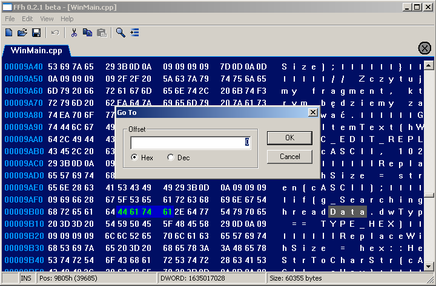
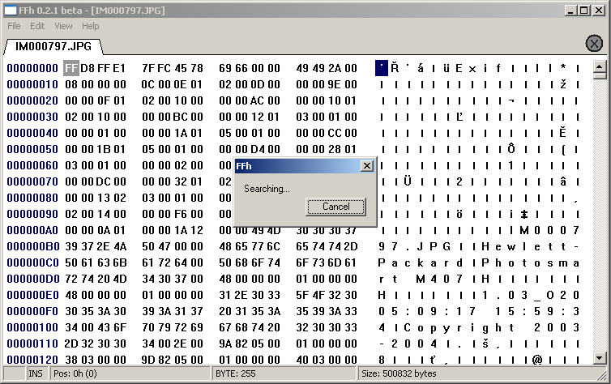
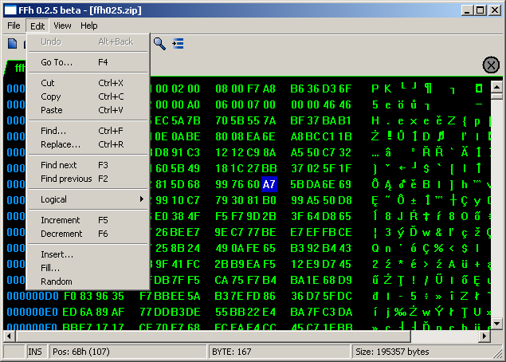
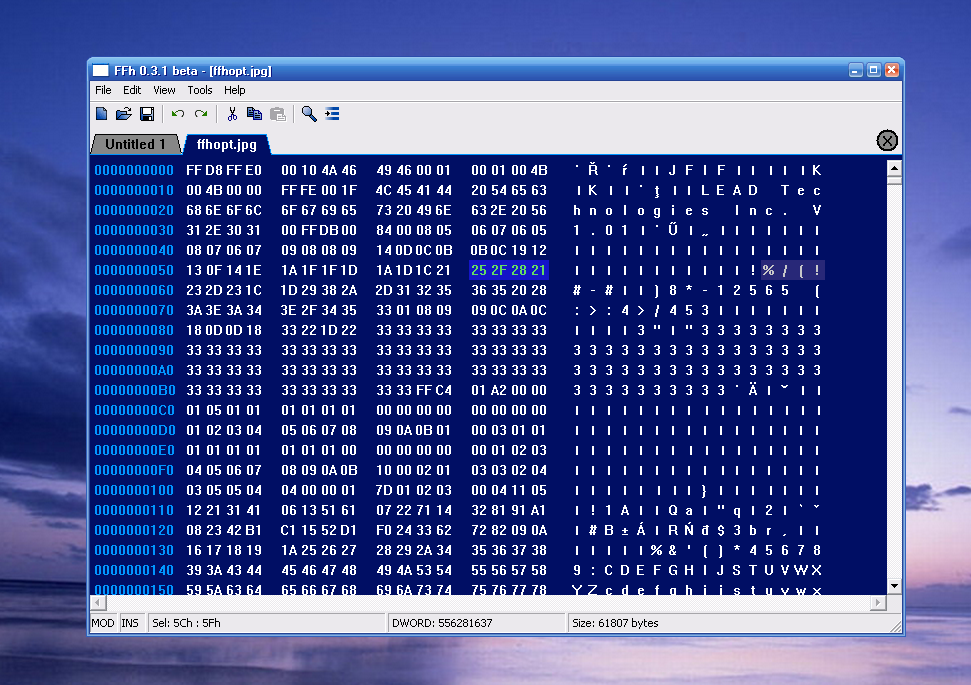

# FFh 0.3.1 beta

*FFh 0.3.1 beta* is a free 32-bit hexadecimal editor for *Windows 98/Me/2000/XP/Vista/7*. It was designed to edit large files by keeping in memory only the data that has been modified or added by the user. Thanks to this, it is possible to work comfortably with files that exceed the amount of available RAM (up to 4GB).

FFh was available for download on the Polish website of *PC World* magazine.

> [!IMPORTANT]
> The app was released in 2007 and is no longer developed due to the loss of a part of the codebase.

> [!WARNING] 
> The latest version of the app is still a beta version, so I encourage everyone to make copies of each important file being edited.

